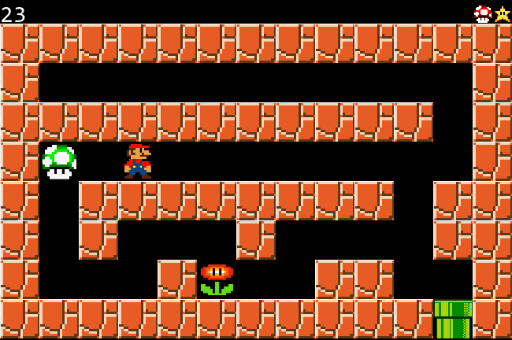

# Maze Game 🕹️
A basic maze game that utilizes object oriented programming on the pygame library.



## Dependencies
The dependencies required to run this game are Python 3, Flask, and Pygame

## Installation

1. Create a virtual environment by opening the windows terminal or powershell by running the command ```python -m venv vir_env```, or in Unix run the command ```python3 -m venv __virtualEnv```
2. After creating the virtual environment, activate it by running ```.\__virtualEnv\Sctripts\activate.bat``` in windows terminal or ```.\__virtualEnv\Sctripts\activate.ps1``` in powershell or ```source _virtualEnv/bin/activate``` for unix machines
   1. Upon activating the virtual environment, your command line should change to have “(__virtualEnv)” at the beginning
3. Run the command  ```pip install pygame``` as well as ```pip install Flask``` on the command line
4. After pygame finishes installing, run main.py by typing ```python main.py```


## Web API
To see your highscores stored on a webpage once you have completed a few games:

1. cd into the web folder run app.py by typing ```python app.py```
2. Visit the link displayed in the console to see your scores. Enter the link into your browser and add "/api/list" to the end of the URL. For example: localhost:3000/api/list
3. You will now be able to see the highscore along with the player's name who set those scores.


## Controls
WASD to move up, left, down, right respectively
- Pressing the key will move the Player one spot.
- Holding the key down will move the Player continuously at a rate of one spot per second.

Q or ESC
- Pressing the Q or ESC key will close the pygame window


## Win Condition
In order to win, you must collect all the items randomly laid out in the maze and proceed to the exit before the time runs out.

## Lose Condition
There are two ways that you could lose the game:
* By reaching the exit without collecting all the items
* The timer at the top left reaching 0 before you fulfill the win condition
